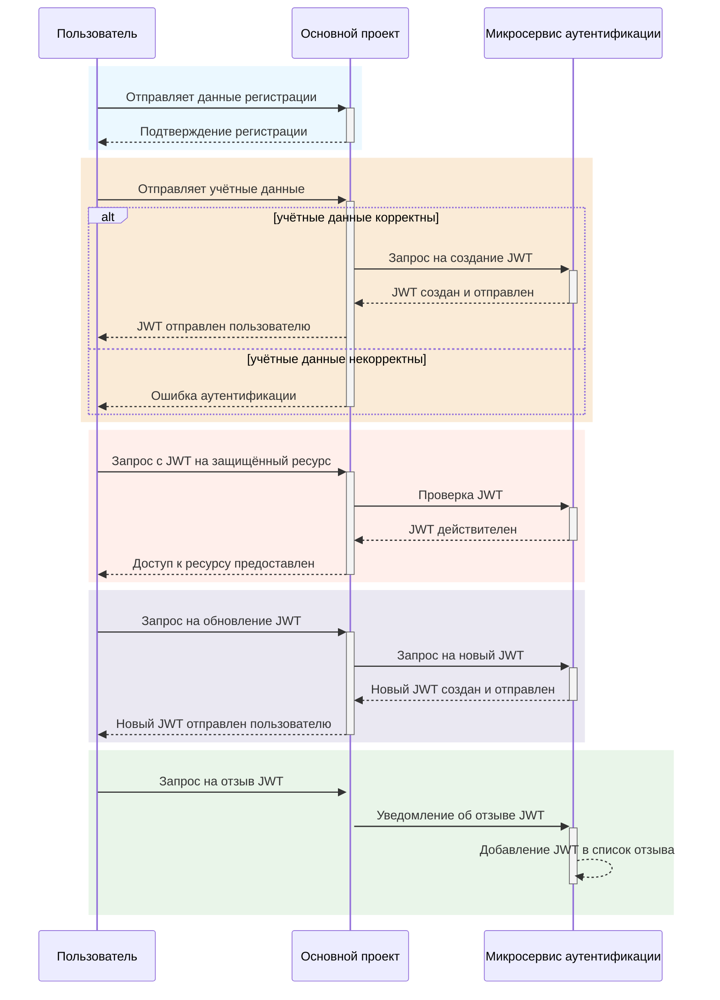

# Диаграмма последовательности для схемы, когда Микросервис Аутентификации работает отдельно от Основного проекта

## Регистрация пользователя:

 * Пользователь отправляет данные регистрации на ОП.
 * ОП сохраняет данные пользователя в базе данных и отправляет подтверждение регистрации пользователю.

## Логин пользователя:

 * Пользователь отправляет учётные данные на ОП.
 * ОП проверяет учётные данные в базе данных.
* Если данные верны, ОП запрашивает у МА создание JWT.
* МА создаёт JWT и отправляет его обратно в ОП.
* ОП отправляет JWT пользователю.

## Использование JWT:

* Пользователь отправляет запрос на защищённый ресурс с JWT.
* ОП проверяет JWT с помощью публичного ключа МА.

## Обновление токенов:

* Если JWT истекает, ОП запрашивает у МА новый токен.
* МА выдаёт новый токен и отправляет его ОП, который передаёт его пользователю.

## Отзыв токенов:

 * Если пользователь выходит из системы или его сессия аннулируется, ОП сообщает МА об отзыве токена.
 * МА добавляет токен в список отзыва.

# Схема

